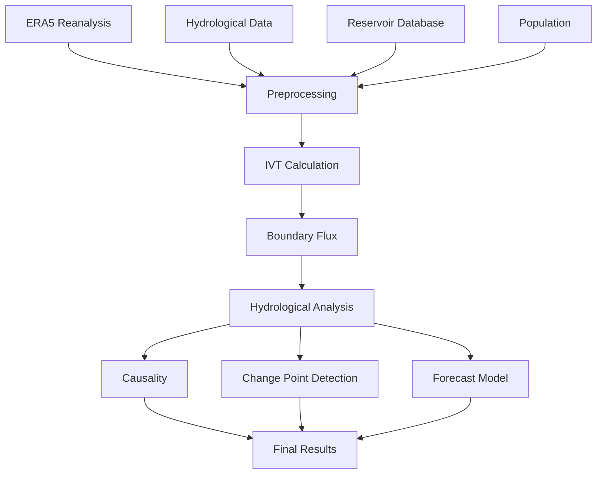

# Caspian Sea Research Project

<div align="center">

# 🌊 Caspian Sea Hydroclimate Analysis Framework

**A comprehensive scientific framework for analyzing Caspian Sea Level variability, atmospheric moisture transport, hydroclimatic drivers, and future projections (1940–2025).**


---

*A reproducible research repository integrating atmospheric, hydrological, remote sensing, and statistical analyses of the Caspian Sea.*

</div>

---

# Table of Contents

- Overview
- Research Background
- Key Contributions
- Scientific Objectives
- Repository Structure
- Installation
- System Requirements
- Quick Start

---

# Overview

This repository contains the complete research workflow used for investigating long-term variations in the Caspian Sea Level (CSL) and the hydroclimatic mechanisms controlling these fluctuations.

The project integrates multiple independent observational and reanalysis datasets into a unified processing pipeline capable of reproducing all analyses, figures, statistical results, and projections presented in the accompanying research paper.

Rather than focusing on a single environmental factor, the framework combines atmospheric moisture transport, hydrological observations, remote sensing products, reservoir dynamics, demographic information, and statistical learning methods to provide a comprehensive understanding of Caspian Sea variability.

---

# Research Background

The Caspian Sea is the largest enclosed inland water body on Earth and has experienced substantial water-level fluctuations throughout the last century.

During recent decades, accelerated declines in water level have become an important environmental concern because they directly affect

- coastal ecosystems,
- fisheries,
- navigation,
- regional infrastructure,
- freshwater resources,
- socioeconomic activities,
- international coastal management.

Understanding these fluctuations requires integrating atmospheric circulation, terrestrial hydrology, and human influences within a common analytical framework.

This project provides such a framework by combining modern climate reanalysis, satellite observations, hydrological records, and statistical modelling into one reproducible research workflow.

---

# Study Period

**1940–2025**

The analyses include long-term historical observations together with recent satellite-era datasets to investigate variability across seasonal, interannual, and multidecadal time scales.

---

# Scientific Components

The framework combines information from several independent domains.

## Atmospheric Processes

- Integrated Vapor Transport (IVT)
- Moisture Flux
- Atmospheric Circulation
- ERA5 Reanalysis

## Hydrology

- Volga River discharge
- Basin precipitation
- Evaporation
- Water balance

## Remote Sensing

- Satellite altimetry
- Shoreline observations
- Surface monitoring

## Human Influences

- Reservoir operation
- Population growth
- Anthropogenic pressure

## Statistical Analysis

- Trend analysis
- Change-point detection
- Causality analysis
- Forecast modelling

---

# Major Findings

According to the analyses presented in this repository,

- atmospheric moisture follows a persistent North Atlantic–Volga transport corridor;
- the net atmospheric moisture transport exhibits a strong west-to-east asymmetry;
- Volga River discharge is identified as the dominant hydroclimatic driver of Caspian Sea Level variability;
- reservoir surface area has substantially decreased during the last decades;
- basin population has continuously increased;
- future scenarios indicate different possible trajectories for Caspian Sea Level through 2030 depending on hydroclimatic conditions.

---

# Scientific Objectives

The primary objectives of this project are:

- quantify atmospheric moisture transport,
- investigate hydrological controls,
- identify dominant climate drivers,
- evaluate long-term variability,
- detect abrupt hydroclimatic changes,
- investigate causal relationships,
- estimate future sea-level evolution,
- provide reproducible scientific workflows.

---

# Repository Structure

```

caspian-sea-research/
│
├── caspian_analysis_fa.tex
├── caspian_analysis_en.tex
├── README.md
├── requirements.txt
├── compile.py
│
├── figures/
│
├── scripts/
│
├── data/
│
└── manual/

```

## Directory Description

| Folder | Description |
|---------|-------------|
| figures | Figures generated throughout the analysis |
| scripts | Python analysis scripts |
| data | Sample datasets and GIS layers |
| manual | User documentation |
| README.md | Project overview |
| compile.py | Automatic LaTeX compilation utility |

---

# Installation

## System Requirements

| Component | Recommended |
|-----------|-------------|
| Python | 3.10 or newer |
| Operating System | Windows / Linux / macOS |
| LaTeX | MiKTeX or TeX Live |
| Disk Space | ≥ 50 GB (recommended for ERA5 data) |

---

## Clone Repository

```bash
git clone https://github.com/your-username/caspian-sea-research.git

cd caspian-sea-research
```

---

## Install Dependencies

```bash
pip install -r requirements.txt
```

---

## Configure CDS API

Create the `.cdsapirc` configuration file using your Copernicus Climate Data Store credentials before downloading ERA5 datasets.

---

# Quick Start

After installation, individual processing modules can be executed independently from the `scripts/` directory.

Subsequent sections describe the available datasets, methodology, analytical workflow, and execution commands in detail.

# Data Sources

Reliable scientific analysis requires integrating multiple independent datasets representing atmospheric circulation, hydrology, remote sensing, and anthropogenic influences.

This project combines these datasets into a unified processing workflow, ensuring temporal consistency and reproducibility throughout all analyses.

---

# Atmospheric Reanalysis

## ERA5

The primary atmospheric dataset used in this research is the ERA5 global reanalysis produced by the Copernicus Climate Change Service (C3S).

Monthly datasets covering the period from **1940 to 2024** were utilized throughout the analysis.

### Variables

The following atmospheric variables are required:

| Variable | Description |
|----------|-------------|
| q | Specific Humidity |
| u | Zonal Wind Component |
| v | Meridional Wind Component |
| ps | Surface Pressure |
| tp | Total Precipitation |
| e | Evaporation |

ERA5 provides physically consistent atmospheric fields suitable for long-term climatological investigations and vertically integrated moisture transport calculations.

---

# Hydrological Data

Hydrological observations complement atmospheric analyses by describing the terrestrial water balance of the Caspian basin.

## Volga River Discharge

The Volga River is the dominant freshwater source of the Caspian Sea.

Observed discharge records are used to investigate:

- annual variability
- seasonal discharge cycles
- long-term trends
- relationships with atmospheric circulation
- influence on sea-level variability

---

## Sea Level Observations

Observed Caspian Sea Level data are compiled from satellite altimetry products and international monitoring services.

These observations provide an independent reference for evaluating long-term hydroclimatic variability.

---

# Reservoir Database

Reservoir information is incorporated to quantify anthropogenic regulation of river discharge.

The database includes

- reservoir locations,
- reservoir surface area,
- temporal evolution,
- regulation impacts.

These datasets allow assessment of human-induced modifications to basin hydrology.

---

# Population Dataset

Population density is used as an indicator of increasing anthropogenic pressure across the Caspian basin.

Spatial population products provide consistent estimates throughout the study period.

---

# Geographic Data

The project uses GIS vector datasets for spatial masking and watershed analysis.

Required shapefiles include

- watershed boundaries,
- shoreline polygons,
- basin masks.

These datasets define the computational domain for atmospheric moisture transport calculations.

---

# Data Directory

```
data/

├── LAND3.shp
├── LAND3.dbf
├── LAND3.shx
├── LAND3.prj

├── caspian_polygon_fixed.shp
├── caspian_polygon_fixed.dbf
├── caspian_polygon_fixed.shx

├── ERA5/

├── Hydrology/

├── Population/

└── Reservoirs/
```

---

# Methodology

The analysis follows a modular scientific workflow.

```text
Atmospheric Data
        │
        ▼
ERA5 Processing
        │
        ▼
Moisture Flux Calculation
        │
        ▼
Boundary Flux Integration
        │
        ▼
Hydrological Analysis
        │
        ▼
Statistical Analysis
        │
        ▼
Forecast Model
        │
        ▼
Figures & Tables
```

---

# Vertically Integrated Moisture Flux

Atmospheric moisture transport is quantified using vertically integrated water vapor flux.

The computation integrates moisture transport through the atmospheric column from the surface to the selected upper pressure level.

The resulting fields describe both the magnitude and direction of atmospheric water vapor transport into and out of the Caspian basin.

---

# Net Boundary Flux

Boundary fluxes are evaluated independently along the watershed boundary.

Each boundary segment contributes to the total moisture budget according to

- outward normal direction,
- segment length,
- integrated moisture transport.

The combined fluxes provide estimates of

- moisture inflow,
- moisture outflow,
- net atmospheric contribution.

---

# Change Point Detection

Potential abrupt changes in hydroclimatic behaviour are investigated using three complementary approaches.

## Binary Segmentation

Detects statistically significant structural breaks within long-term climate records.

---

## Window-Based Analysis

Applies moving temporal windows to identify localized transitions.

---

## Voting Strategy

Combines multiple detection algorithms into a consensus estimate, improving robustness and reducing false detections.

---

# Forecast Model

Future Caspian Sea Level evolution is estimated using a Ridge Regression model trained on historical hydroclimatic observations.

Predictor variables include atmospheric and hydrological indicators derived throughout the workflow.

Model performance is evaluated using

- coefficient of determination (R²),
- Root Mean Square Error (RMSE),
- independent validation procedures.

---

# Scientific Workflow



---

# Reproducibility

Every stage of the workflow is designed to be reproducible.

Independent processing modules generate figures, statistical outputs, and tables directly from the original datasets, allowing complete regeneration of the published results.

# Running the Analyses

All analytical workflows are implemented as independent Python modules, allowing each component of the research pipeline to be executed separately or integrated into an automated workflow.

---

# Available Processing Modules

| Module | Description |
|---------|-------------|
| Precipitation Extraction | Extract precipitation data from monthly ERA5 Zarr datasets |
| Evaporation Extraction | Extract evaporation fields from ERA5 archives |
| Causality Analysis | Evaluate causal relationships between hydroclimatic variables |
| Change Point Detection | Identify abrupt hydroclimatic transitions |
| Future Projection | Estimate future Caspian Sea Level scenarios |
| Figure Generation | Produce all publication-quality figures |

---

# Extract Precipitation

```bash
python scripts/extract_precip_from_zarr.py
```

This module

- reads monthly ERA5 archives,
- extracts precipitation fields,
- performs preprocessing,
- prepares data for subsequent analyses.

---

# Extract Evaporation

```bash
python scripts/extract_evap_from_zarr.py
```

Outputs include

- evaporation datasets,
- monthly summaries,
- processed variables used throughout the analysis.

---

# Causality Analysis

```bash
python scripts/causality.py
```

The causality module evaluates relationships among atmospheric, hydrological, and sea-level variables.

Typical analyses include

- lag relationships,
- statistical significance,
- directional influence,
- sensitivity analysis.

---

# Change Point Detection

```bash
python scripts/change_point.py
```

This module identifies abrupt changes in long-term hydroclimatic records using multiple complementary algorithms.

Outputs include

- detected breakpoints,
- confidence estimates,
- graphical summaries.

---

# Future Projection

```bash
python scripts/ultimate_test.py
```

The forecasting workflow estimates future Caspian Sea Level evolution using statistical learning techniques trained on historical hydroclimatic observations.

Model outputs include

- projected sea-level trajectories,
- uncertainty estimates,
- scenario comparisons.

---

# Generate All Figures

```bash
python scripts/analysis_final_code.py
```

Executing this script regenerates every figure used throughout the research paper.

Generated products typically include

- climatological maps,
- moisture transport vectors,
- temporal trends,
- statistical diagrams,
- validation figures.

---

# Compiling the Paper

The repository supports both automated and manual compilation of the accompanying scientific manuscript.

---

## One-Click Compilation

```bash
python compile.py
```

The compilation utility automatically generates both Persian and English PDF versions of the manuscript while resolving auxiliary build steps whenever possible.

---

## Manual Compilation

### Persian Version

```bash
xelatex caspian_analysis_fa.tex

bibtex caspian_analysis_fa

xelatex caspian_analysis_fa.tex

xelatex caspian_analysis_fa.tex
```

---

### English Version

```bash
pdflatex caspian_analysis_en.tex

bibtex caspian_analysis_en

pdflatex caspian_analysis_en.tex

pdflatex caspian_analysis_en.tex
```

---

## Compile User Manual

```bash
cd manual

xelatex manual.tex

bibtex manual

xelatex manual.tex

xelatex manual.tex
```

---

# Troubleshooting

## Missing Figures

If expected figures are not available,

- verify that all processing scripts completed successfully;
- regenerate figures using the complete analysis workflow;
- confirm output directories exist.

---

## LaTeX Compilation Errors

Recommended checks:

- install all required LaTeX packages;
- ensure Persian packages are available when compiling the Persian manuscript;
- verify that required fonts are installed;
- remove auxiliary files before recompilation if necessary.

---

## Python Errors

Common issues include

- missing dependencies,
- incorrect CDS API credentials,
- unavailable datasets,
- invalid file paths,
- missing GIS shapefiles.

Always verify the project structure before running analysis modules.

---

## Performance Recommendations

Large ERA5 archives may require substantial processing time.

For improved performance:

- execute analyses on SSD storage;
- increase available system memory when possible;
- adjust worker configuration for parallel execution;
- process datasets sequentially if memory is limited.

---

# Citation

If this repository contributes to your research, please cite the accompanying scientific publication.

```bibtex
@article{Farjami2026,
  author  = {Farjami, H. and Fazl Kazemi, A. and Barzgar, N. and Lahijani, H. A. K.},
  title   = {Moisture Transport and Water Regulation Drive Caspian Sea Level Changes},
  year    = {2026},
  journal = {Journal Name},
  doi     = {DOI}
}
```

---

# License

This project is distributed under the **MIT License**.

See the `LICENSE` file for complete licensing information.

---

# Acknowledgements

This work makes use of datasets and services provided by several international organizations and scientific institutions.

The research acknowledges support from

- Iranian National Institute for Oceanography and Atmospheric Science (INIOAS)
- Iran Meteorological Organization (IRIMO)
- Copernicus Climate Change Service (C3S)
- CASPCOM
- WorldPop Project
- Hydroweb
- Iran National Science Foundation (INSF)

---

# Contact

For questions regarding the scientific methodology, datasets, or repository, please contact the corresponding author.

**Email**

```
h.farjami@inio.ac.ir
```

---

# Contributing

Contributions are welcome.

Before submitting a pull request, please

- follow the repository coding style;
- document methodological changes;
- include appropriate references;
- ensure reproducibility of newly added analyses.

---

# Future Development

Planned improvements include

- expanded machine learning models,
- higher-resolution climate datasets,
- automated validation workflows,
- interactive visualization dashboards,
- cloud-native processing pipelines,
- enhanced uncertainty quantification.

---

# Final Remarks

This repository has been developed to provide a transparent, reproducible, and scientifically rigorous framework for investigating the hydroclimatic dynamics of the Caspian Sea.

By integrating atmospheric reanalysis, hydrological observations, remote sensing products, and statistical analyses into a unified workflow, the project enables researchers to reproduce published results, explore new scientific questions, and extend the framework to future investigations.

---

<div align="center">

### 🌊 Advancing reproducible hydroclimate research for the Caspian Sea

**If you find this project useful, please consider citing the associated publication.**

</div>